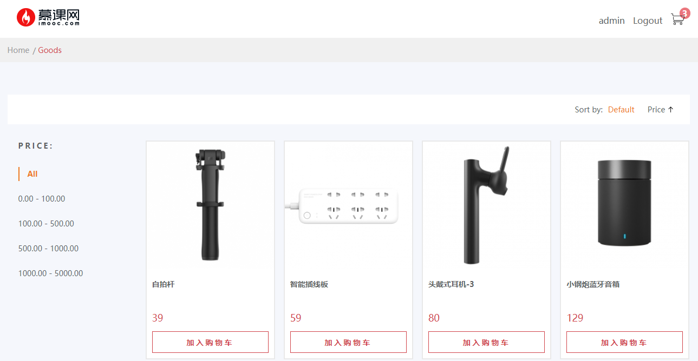
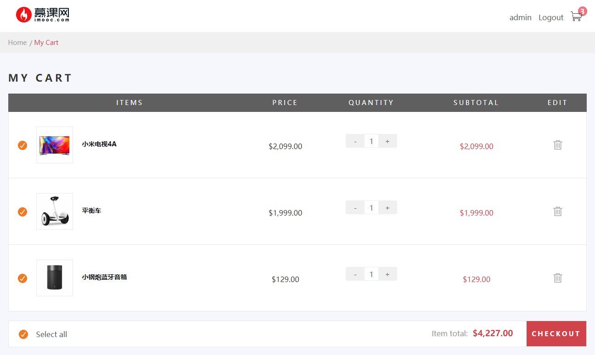
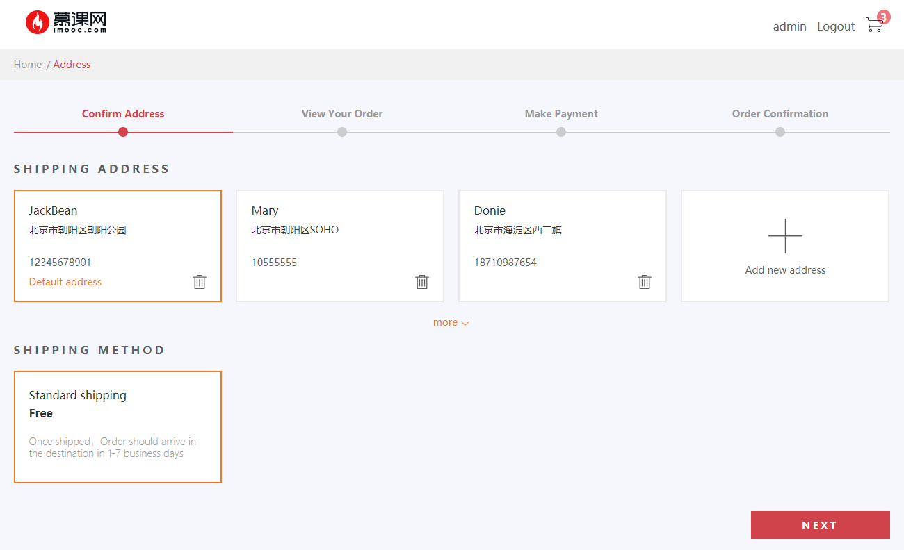
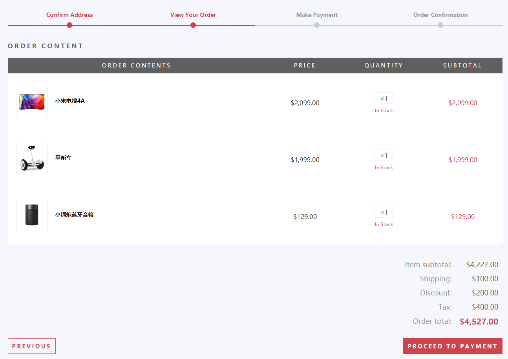
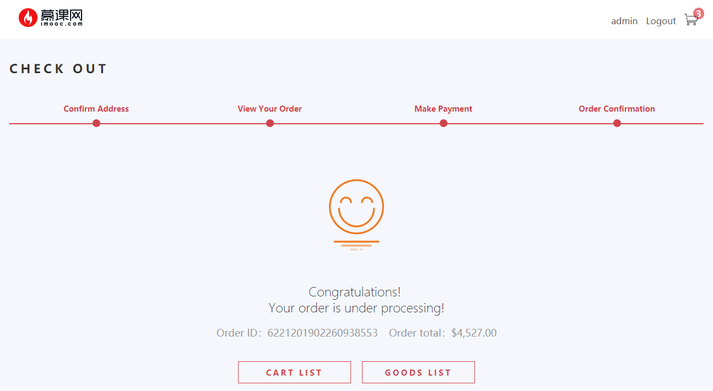

# vue-imoocmall

## 1. 项目描述

本项目为一个商场项目，主要包括商品列表模块（可进行价格筛选、排序），购物车页面展示，地址模块、订单确认模块，订单成功模块，登录模块、地址模块等。

本项目前台主要通过 Vue Cli 3.0 进行脚手架搭建，项目采用了 Vue、 Vue Router、 vuex 以及 ES6语法等。通过 axios 来实现数据接收和页面渲染。

本项目后台主要通过 Node.js 进行实现，通过 Express框架 实现后端的 REST接口，并以 JSON 的形式输出，并且通过 MongoDB 进行数据存储。

## 2. 如何运行

+ 克隆代码：`git clone https://gitee.com/VueToLRH/vue-imoocmall.git`
+ 安装相关依赖：`npm install` (或使用淘宝镜像：`cnpm install`)
+ 安装 MongoDB 数据库，开启 MongoDB 数据库服务
+ 创建 dumall 数据库，导入相关数据库文件 ( 文件存放于 [readme/dumall数据库](./readme/dumall数据库) 文件夹中，MongoDB相关操作可以参考 [MongoDB安装等相关操作](./readme/MongoDB/MongoDB.md))

  ``` shell
    >>> # 导入命令
    >>> mongoimport -d [连接的数据库名] -c [集合名] --file [文件地址]
    >>> # -d 表示连接的数据库
    >>> # -c 表示连接数据库中的集合
    >>> # --file 表示导入的文件路径
  ```

+ 连接数据：在 [server/routes/goods.js](./server/routes/goods.js) 中，创建数据库连接
+ 启动 Node 服务：`node server/bin/www`
+ 运行项目：`npm run serve`

## 3. 项目备注

+ [MongoDB 安装、基础操作参考](./readme/MongoDB/MongoDB.md)
+ Mongoose 是在 Node.js 环境下对 MongoDB 进行便捷操作的对象模型工具。Mongoose 相关操作可参考：[一篇文章带你入门 Mongoose](https://segmentfault.com/a/1190000012095054#articleHeader31)、[Mongoose 基础操作](https://blog.csdn.net/o_Mario_o/article/details/80221386)
+ vue-infinite-scroll 滚动加载插件，可以无限滚动实现加载更多。其作用：是当滚动条滚动到距离底部的指定高度时触发某个方法。API可参考 [vue滚动加载插件vue-infinite-scroll](https://blog.csdn.net/thatway_wp/article/details/79422368)
+ PM2 启用 Node服务
  + 安装：`npm install pm2 -g` (如果使用 cnpm 需安装淘宝镜像)
  + 启动进程：`pm2 start app.js` (启动进程之后，还可执行其他命令)
  + 停止所有：`pm2 stop all`
  + 停止具体某一个：`pm2 stop app.js`
  + 使用 PM2 进行进程管理可参考 [PM2教程](https://pm2.io/doc/zh/runtime/overview/)
+ Express框架 相关知识参考：[Express 实战系列文章](https://bignerdcoding.com/archives/41.html)、[Express4.x API 翻译](https://segmentfault.com/a/1190000012854696)
+ [基于 Node.js 开发商品列表接口](./readme/REST接口开发.md)

## 4. 项目展示





